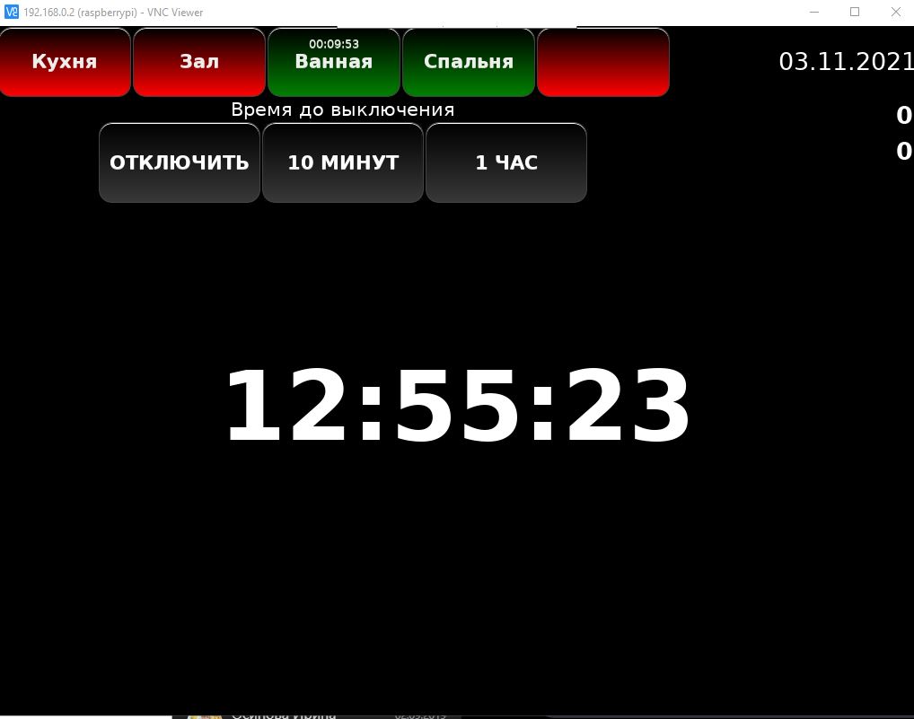
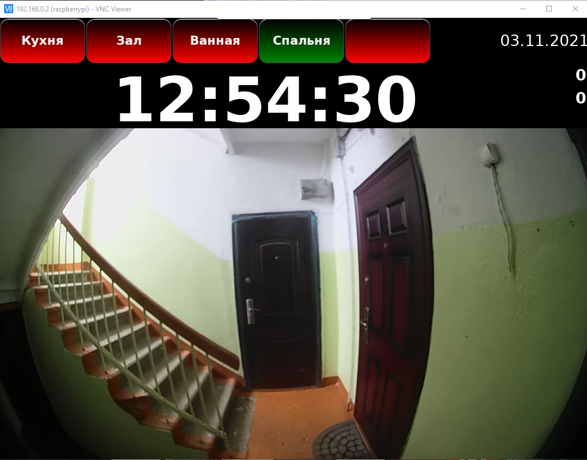
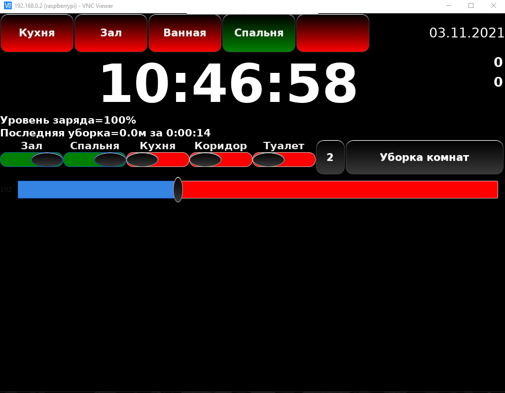

# моя система управления светом в квартире
написана на python
* raspberry pi
* roborock S7
* HLK-SW16(релюшки с али, Управляю через ESp32, свет не зависит от работает ли малинка)
* HDMI дисплей(стоит он правда на 180градусов) свайпы по экрану, кнопочки.
* камера в подьезде(реализована через VLC)
* GPIO реализовано на pigpiod.. 
* куча таймеров.

